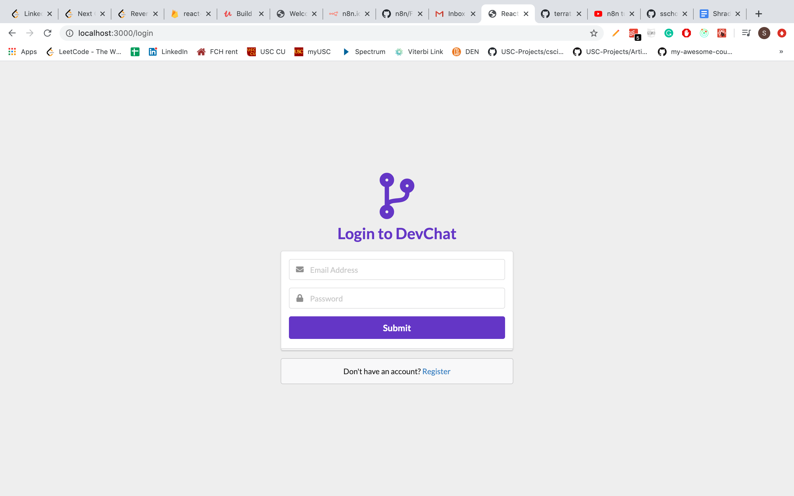
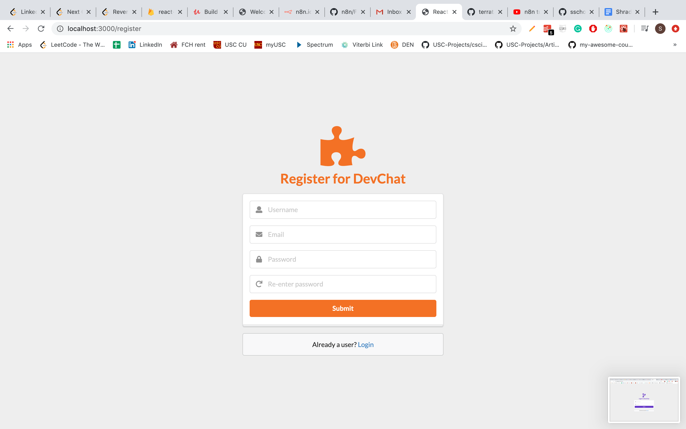
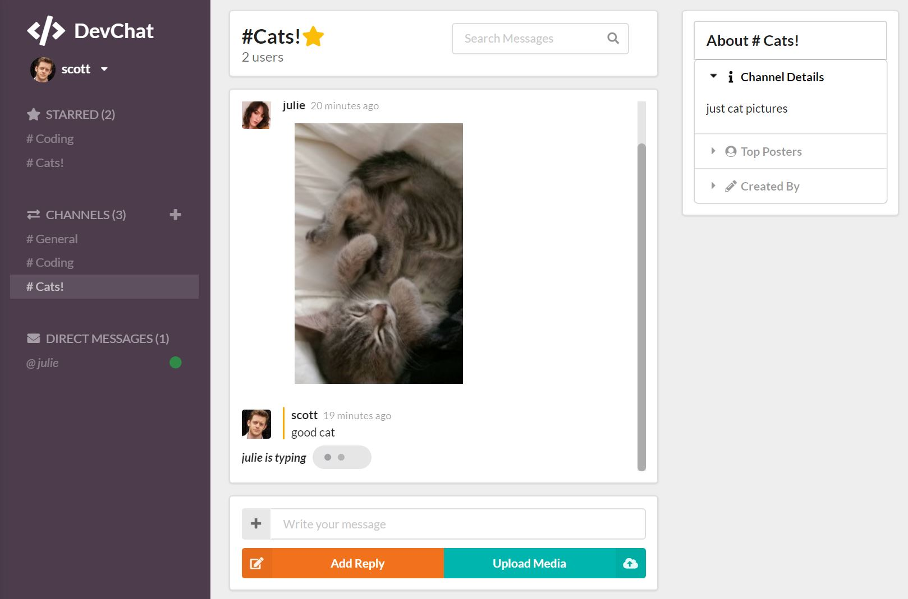
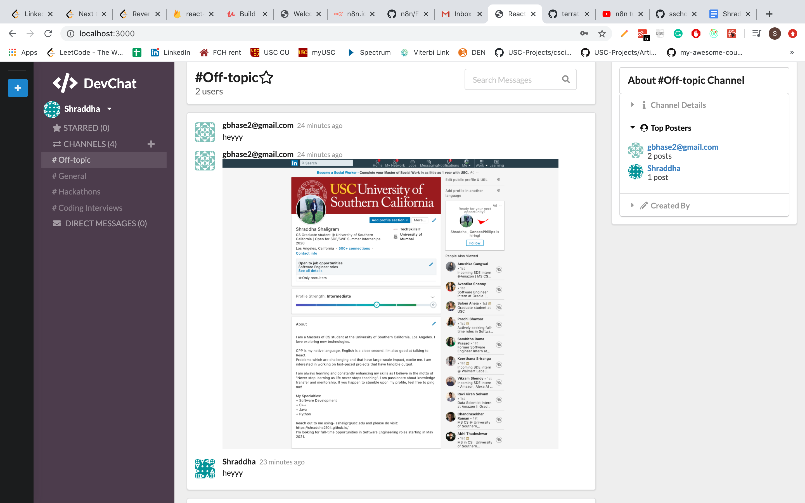

  

# Slack clone - A real time chat service
      

Stack:
- React
- Firebase

## User stories
- Users can choose a nickname
- Users can join chatrooms of their own choosing
- Users can send messages to other users

## Features
- Mobile-friendly UI (Semantic-UI)
- Stores messages on the server (only messages from channels are saved at the moment, but it's quite easy to extend it to support private messages also)
- Supports multiple logged clients at the same time from one user (e.g. desktop & mobile clients)
- Keeps list of online users in real time

## Screenshots

<h2>Login</h2>

<h2>Register</h2>

<h2>Direct Messages</h2>

<h2>Home Page </h2>

 
Possible future improvements:
* Refactor both server & client side code
* Add front end specific tests with e.g. [Jest](https://facebook.github.io/jest/), [enzyme](http://airbnb.io/enzyme/)
* Considering using CSS-in-JS, e.g. [styled-components](https://styled-components.com)
* Optimization
  * More advanced webpack config
  * Prerendering
  * Code splitting 
  
 ## Contributing to Slack-Clone
<!--- If your README is long or you have some specific process or steps you want contributors to follow, consider creating a separate CONTRIBUTING.md file--->
To contribute to Slack-Clone, follow these steps:

1. Fork this repository.
2. Create a branch: `git checkout -b <branch_name>`.
3. Make your changes and commit them: `git commit -m '<commit_message>'`
4. Push to the original branch: `git push origin https://github.com/Shraddha2104/Slack-Clone`
5. Create the pull request.
Alternatively see the GitHub documentation on [creating a pull request](https://help.github.com/en/github/collaborating-with-issues-and-pull-requests/creating-a-pull-request).

## Built With

- [ReactJS](https://reactjs.org/) - A JavaScript library for building user
  interfaces
- [Firebase](https://firebase.google.com/) - Firebase is a Backend as a Service
  (BaaS) provided by Google.
- [Semantic UI](https://react.semantic-ui.com/) - UI Styling

## License

This project is licensed under the MIT License - see the
[LICENSE.md](https://github.com/Shraddha2104/Slack-Clone/blob/master/LICENSE)
file for details

## Anything else?

Remember the rules!

It's _not_ about:

- how good your code is,
- how novel the idea is, or
- how useful the project is.

It _is_ about:

- **Impressive**: People's wows are on record!
- **Design**: Slick UI with search and a snappy bot 24/7!
- **Learning**: React, CORS and auth are always tough!
- **OSS practices**: Plentiful commits, branches, PRs!

<h3 align="center"><b>Developed by <a href="https://github.com/Shraddha2104">Shraddha Shaligram</a>.</b></h1>
